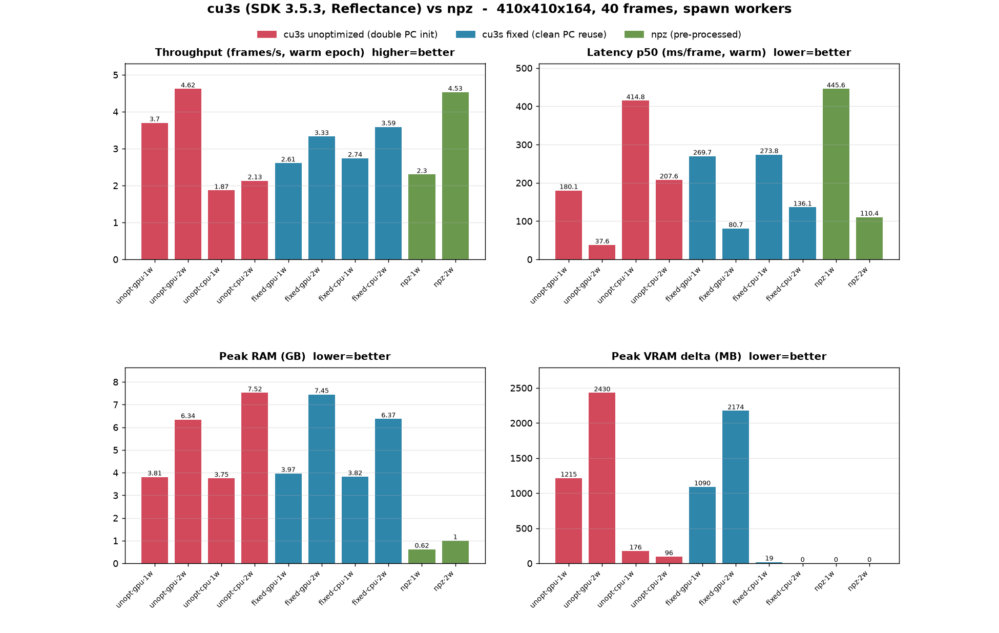

# cu3s vs npz - multi-worker, CPU/GPU, RAM/VRAM (SDK 3.5.3)

Dataset: `dataset_01_aimopto_2026/session_000.cu3s`, 410x410x164 (55 MB/frame float32), 40 frames, `Reflectance`.
Stack: **public PyPI** `cuvis 3.5.3.1` + `cuvis_il 3.5.3.1` against native **CUBERT SDK v. 3.5.3** (no IPC).
Loader: real torch `DataLoader`, `multiprocessing_context="spawn"`, batch_size 1, 2 epochs (cold ep1 / warm ep2).
Faithful to the repo: cu3s uses the base loader (`persistent_workers=False`); npz uses its own loader (`persistent_workers=True`, `pin_memory=True`).
CPU vs GPU = `force_gpu_mode` (`host` / `cuda`) in a copied settings dir, provided via `cuvis.General.init()` in each worker.

Variants:
- **unopt** = repo `Cu3sCubeReader` as on GitHub (reads `mesu0.cube.channels` in `__init__`, which triggers a redundant second `ProcessingContext`).
- **fixed** = `self.session._pc = self.pc` before that lookup, so the channels access reuses the reader's context (bit-identical cubes).
- **npz** = `MultiNpzDataModule` read path over `savez_compressed` frames.

## Results

| variant | device | w | fps cold | fps warm | lat p50 ms | lat p95 ms | RAM GB | VRAM MB |
|---|---|---|---|---|---|---|---|---|
| unopt | gpu | 1 | 3.44 | 3.7 | 180.1 | 294.8 | 3.81 | 1215 |
| unopt | gpu | 2 | 4.5 | 4.62 | 37.6 | 306.1 | 6.34 | 2430 |
| unopt | cpu | 1 | 2.22 | 1.87 | 414.8 | 628.9 | 3.75 | 176 |
| unopt | cpu | 2 | 2.25 | 2.13 | 207.6 | 816.7 | 7.52 | 96 |
| fixed | gpu | 1 | 2.16 | 2.61 | 269.7 | 443.0 | 3.97 | 1090 |
| fixed | gpu | 2 | 2.8 | 3.33 | 80.7 | 424.3 | 7.45 | 2174 |
| fixed | cpu | 1 | 2.16 | 2.74 | 273.8 | 463.2 | 3.82 | 19 |
| fixed | cpu | 2 | 2.86 | 3.59 | 136.1 | 387.0 | 6.37 | 0 |
| npz | none | 1 | 2.16 | 2.3 | 445.6 | 459.8 | 0.62 | 0 |
| npz | none | 2 | 4.04 | 4.53 | 110.4 | 456.0 | 1.0 | 0 |

## Findings

Robust:
- **The CPU/GPU toggle works.** GPU cu3s holds ~1.1 GB VRAM per worker (1w ~1.1-1.2 GB, 2w ~2.2-2.4 GB); CPU cu3s uses ~0 (19-176 MB is noise); npz uses 0. Each GPU worker process creates its own CUDA context - VRAM scales linearly with workers.
- **RAM scales ~3 GB per cu3s worker, independent of device** (1w ~3.8 GB, 2w ~6.3-7.5 GB). npz workers are ~6-8x lighter (~0.3-0.5 GB each).
- **npz reaches the same throughput as the best cu3s at a fraction of the resources.** npz/2w = 4.53 fps at 1.0 GB RAM and 0 VRAM; the fastest cu3s (unopt/gpu/2w) = 4.62 fps but costs 6.3 GB RAM + 2.4 GB VRAM.
- **GPU gives lower per-frame latency than CPU** where comparable (fixed/gpu/2w p50 80.7 ms vs fixed/cpu/2w 136.1 ms; unopt/gpu/2w 37.6 ms vs unopt/cpu/2w 207.6 ms). CPU trades that latency for freeing ~1-2 GB VRAM for the model.
- **A 2nd worker helps npz a lot** (2.3 -> 4.53 fps, persistent + parallel decompress) and **cu3s only modestly** (respawn each epoch + shared-GPU serialization cap the gain).

Not trustworthy in this run (do not over-read):
- **The unopt-vs-fixed throughput ordering is confounded.** unopt/gpu appears faster than fixed/gpu, which is mechanistically implausible (fixed does strictly less work). Cause: single run per config + sequential run order + `persistent_workers=False`, so every epoch respawns workers and re-pays the (~1.8 s) ProcessingContext init - that high-variance overhead dominates the fix's one-time saving at 40 frames. RAM/VRAM are unaffected by this and remain reliable.

To get clean throughput deltas: interleave config order, repeat each 3-5x (report medians), and run with `persistent_workers=True` so steady-state per-frame cost dominates instead of respawn.
