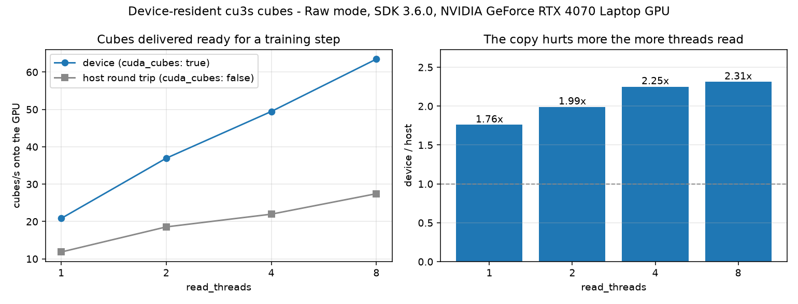

# Device-resident cubes (`cuda_cubes`): what the host round trip costs

Session: `D:\Measurements\hbf\Auto_013+01.cu3s`, 940 frames, cube 1000x1080x61 uint8 (66 MB), `Raw` mode.
Machine: 20 cores, RTX 4070 Laptop (8 GB), Windows 11, native CUBERT SDK 3.6.0, published `cuvis` / `cuvis-il` 3.6.0.0rc1 wheels.

Both arms are measured to the same finish line: **a cube sitting on the GPU, ready for a training step**.
The host arm therefore pays the SDK's device-to-host copy and then torch's host-to-device copy back; the device arm pays neither.
Anything that stops short of the GPU would be measuring the wrong thing, since a cu3s cube that never reaches the GPU is not a cube a model can consume.

Each cell reads 24 frames over a rotating 10-frame window and is the median of three timed passes.
`cuvis.cuda.enable` is process-global and cannot be undone for an already-processed measurement, so the two arms run in two child processes.

Raw numbers: [`results.json`](results.json).

## Throughput onto the GPU

| read_threads | device (`cuda_cubes: true`) | host round trip | ratio |
| --- | --- | --- | --- |
| 1 | 20.83 | 11.84 | 1.76x |
| 2 | 36.95 | 18.56 | 1.99x |
| 4 | 49.46 | 21.97 | 2.25x |
| 8 | **63.48** | 27.45 | **2.31x** |



## Findings

Robust:

- **1.76x to 2.31x, and the gain grows with `read_threads`.** The copy is a shared resource - PCIe and host memory bandwidth - so the more reader threads there are, the more they queue behind it. Threading and this flag compound rather than overlap.
- **The device cube is the same cube.** Checked per element against the host path on real data in `test_cuda_cubes_integration.py`: `np.array_equal` holds exactly. It is the same buffer the SDK already produced, not a re-computation, so this is a copy being skipped rather than a different result.
- **VRAM stays bounded.** Thirty reads never held at once grow the process by under 256 MiB, against roughly 2 GB if each 66 MB buffer were retained. The SDK pools the buffers rather than returning them to the driver, so the plateau, not a return to baseline, is the thing to check.
- **It is worth more than the threading it sits on top of.** At eight threads the device arm reaches 63.5 cubes/s where `benchmarks/threaded_reading/report.md` reaches 53.4 for a read that still ends in host memory, so the flag more than pays back the copy the earlier number was still carrying.

Do not over-read:

- **`Raw` uint8 on this session.** Cost scales with cube bytes, so a uint16 `Reflectance` cube is twice the copy and the ratio should widen; that is an expectation, not a measurement.
- **A discrete desktop GPU is not a laptop GPU on a shared bus.** The absolute cubes/s will move; the shape - a widening gap as threads rise - follows from where the bottleneck is and should not.
- **This is reader throughput, not training throughput.** A step that is compute-bound on a large model will not see 2.3x end to end. It removes a bottleneck; it does not create headroom elsewhere.
- **`num_workers` must be 0**, so this cannot be combined with process-based loading. That is not a benchmark artefact but a hard constraint: a CUDA tensor is not sent across the worker queue.

## Reproducing

```powershell
uv sync --all-extras --extra bench
uv run python benchmarks\cuda_cubes\bench_cuda_cubes.py `
    "D:\Measurements\hbf\Auto_013+01.cu3s" benchmarks\cuda_cubes Raw 24 3
uv run python benchmarks\cuda_cubes\make_charts.py benchmarks\cuda_cubes
```

`bench_cuda_cubes.py` re-execs itself once per mode, because `cuvis.cuda.enable` cannot be undone within a process.
