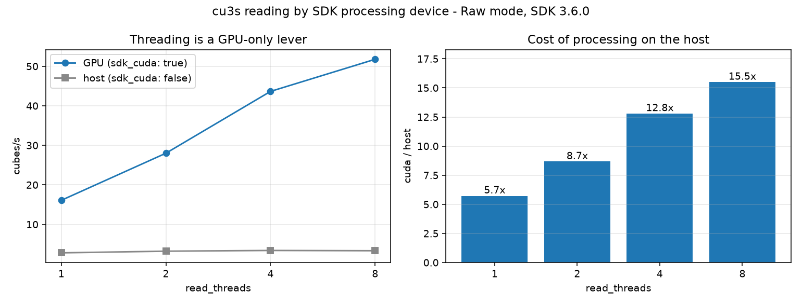

# The SDK processing device (`sdk_cuda`): what the host costs

Session: `D:\Measurements\hbf\Auto_013+01.cu3s`, 940 frames, cube 1000x1080x61, `Raw` mode.
Machine: 20 cores, RTX 4070 (8 GB), Windows 11, native CUBERT SDK 3.6.0 (build `dfcc3e3`), published `cuvis` 3.6.0.0rc2 / `cuvis-il` 3.6.0.0rc1 wheels.

Each cell reads 24 frames over a rotating 10-frame window and is the median of five timed passes.
The SDK fixes its device at the first `cuvis.init` of a process and ignores every later one, so the two devices are measured in two child processes rather than one.
Both go through the package's own seam (`configure_cuvis_sdk` then `require_cuvis`), so what is measured is the parameter a user sets rather than a hand-rolled `cuvis.init`.

Raw numbers: [`results.json`](results.json).

## Why this exists

On SDK 3.6.0, a process that never calls `cuvis.init` processes on the **host**.
Nothing in this package called it, so the 3.6.0 upgrade would have silently moved every cu3s read onto the CPU.
`sdk_cuda` restores the choice and defaults it to the GPU.

## Throughput by device

| read_threads | GPU (`sdk_cuda: true`) | host (`sdk_cuda: false`) | ratio |
| --- | --- | --- | --- |
| 1 | 16.10 | 2.81 | 5.7x |
| 2 | 28.01 | 3.23 | 8.7x |
| 4 | 43.64 | 3.41 | 12.8x |
| 8 | **51.76** | 3.34 | **15.5x** |



## Findings

Robust:

- **The GPU is 5.7x faster before any threading**, 16.10 against 2.81 cubes/s. That is the number a default `num_workers: 0`, `read_threads: 0` config gets back.
- **Threading is a GPU-only lever.** On the host, eight handles reach 3.34 cubes/s against a 2.81 single-handle baseline: 1.19x against 3.2x on the GPU. The two features are therefore not independent - `read_threads` without `sdk_cuda` is nearly dead weight, and the combined gap at eight threads is 15.5x.
- **Host mode is not a cheaper mode, it is a fallback.** It costs the full 6-16x and buys no memory back that matters at these thread counts.
- **The device does not meaningfully change the cube.** Cross-checked per element in `test_sdk_device_integration.py`: on this session the two implementations disagree by one LSB on 0.0001% of elements (about 66 of 65.9 million) and by no more than one LSB anywhere, which is rounding in the cubalize interpolation, far under sensor noise. A model trained on one device is not seeing different data on the other.
- **Setup is device-independent**, 12.27-13.91 s in every cell. The `ProcessingContext` LUT build dominates process start-up either way, so switching to the host does not even save the wait.

Do not over-read:

- **Do not compare these cubes/s against `benchmarks/threaded_reading/report.md`.** That run reached 55.6 cubes/s at eight threads where this one reaches 51.8, on the same machine and session. The two runs differ in GPU thermal state and in what ran immediately before, and only within-report rows are controlled against each other. Both reports' *shapes* agree; their absolute cells do not transfer.
- **`Raw` mode only.** `Reflectance` and `SpectralRadiance` do more arithmetic per cube, so the host penalty there is likely larger rather than smaller, but that is an expectation and not a measurement.
- **One GPU.** On a card slower than an RTX 4070, or one already saturated by training, the ratio shrinks. It is a reason to keep the flag, not a reason to doubt the default.
- **A machine without CUDA is not this measurement.** There the SDK falls back to the host on its own and `sdk_cuda: true` costs nothing beyond a log line.

## Reproducing

```powershell
uv sync --all-extras --extra bench
uv run python benchmarks\sdk_device\bench_device.py `
    "D:\Measurements\hbf\Auto_013+01.cu3s" benchmarks\sdk_device Raw 24 5
uv run python benchmarks\sdk_device\make_charts.py benchmarks\sdk_device
```

`bench_device.py` re-execs itself once per device and merges the two results, because one device per process is the only way the SDK allows both to be measured.
