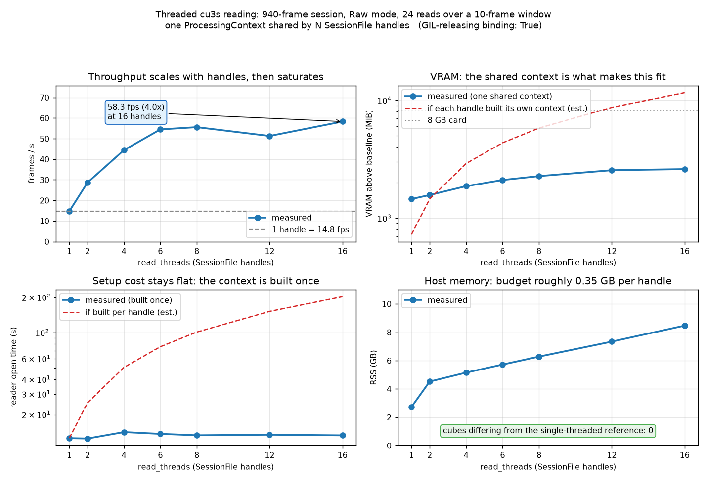
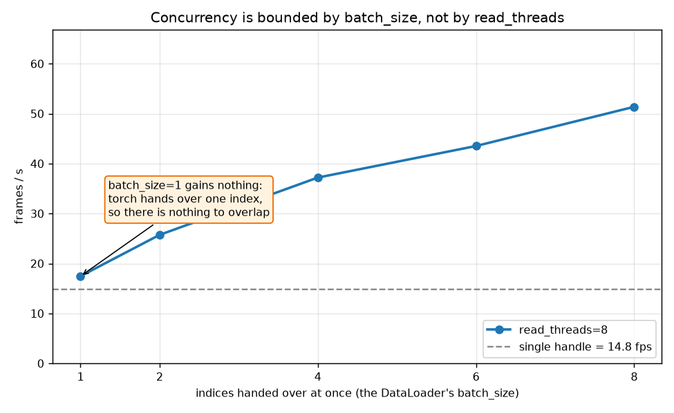

# Threaded cu3s reading: `read_threads` scaling and the `batch_size` ceiling

Session: `D:\Measurements\hbf\Auto_013+01.cu3s`, 940 frames, cube 1000x1080x61, `Raw` mode.
Machine: 20 cores, RTX 4070 (8 GB), Windows 11, native CUBERT SDK 3.6.0 (build `dfcc3e3`).
Binding: the published `cuvis` 3.6.0.0rc2 / `cuvis-il` 3.6.0.0rc1 wheels from PyPI.
The probe in `data/_extras.py` confirmed the binding releases the GIL before any number below was taken.

Topology under test: N `cuvis.SessionFile` handles on one file, all sharing a single `cuvis.ProcessingContext`.
Each cell reads 24 frames over a rotating 10-frame window through `Cu3sPrefetchReader.read_many`, after a warm-up of `read_threads` frames.
Every cell is the median of five timed passes on one open reader, so a cell is separable from run-to-run spread.
Three was not enough: at three repeats the four-thread cell landed on 32.7 cubes/s against 48.8 at six, which the wider sample shows was sampling noise rather than a dip.
Correctness is checked per frame with blake2b against a single-threaded reference, and the hashing happens outside the timed region.

The process forces `force_gpu_mode=cuda` through `cuvis.init` before opening anything.
That is a new requirement: on SDK 3.6.0 a process that never calls `cuvis.init` processes on the host at about 3.9 fps single-threaded, against 14.9 fps here, which would drown the effect being measured.
The library does not yet do this itself; the host-versus-cuda comparison belongs with that work.

Raw numbers: [`results.json`](results.json), including the individual passes behind each median as `fps_runs`.

## Thread scaling

| read_threads | fps | scaling | setup s | VRAM MiB | RSS GB | wrong cubes |
| --- | --- | --- | --- | --- | --- | --- |
| 1 | 14.75 | 1.00x | 12.64 | 1451 | 2.73 | 0 |
| 2 | 28.66 | 1.94x | 12.55 | 1569 | 4.52 | 0 |
| 4 | 44.42 | 3.01x | 14.24 | 1865 | 5.15 | 0 |
| 6 | **54.51** | **3.70x** | 13.75 | 2103 | 5.72 | 0 |
| 8 | 55.59 | 3.77x | 13.37 | 2270 | 6.28 | 0 |
| 12 | 51.31 | 3.48x | 13.53 | 2548 | 7.34 | 0 |
| 16 | 58.31 | 3.95x | 13.35 | 2603 | 8.47 | 0 |



## The `batch_size` ceiling

`read_threads` fixed at 8, varying how many indices are handed over per call, which is exactly what a torch `DataLoader`'s `batch_size` controls.

| batch_size | fps | scaling |
| --- | --- | --- |
| 1 | 17.46 | 1.18x |
| 2 | 25.73 | 1.74x |
| 4 | 37.20 | 2.52x |
| 6 | 43.52 | 2.95x |
| 8 | 51.37 | 3.48x |



## Findings

Robust:

- **A published wheel now carries the GIL release.** Every earlier run of this benchmark needed a locally built `cuvis.pyil`, which is why the feature shipped with a probe and a fallback and why no user could reach the fast path from `pip install`.
  `cuvis-il` 3.6.0.0rc1 from PyPI releases the GIL, and the probe agrees.
- **Threading works, and the win is large.** 14.75 to 54.51 fps at six threads, 3.70x, on the same hardware and the same session.
  Nothing in the Python layer changed except that reads now overlap.
- **Zero wrong cubes at every thread count**, 1 through 16, verified per frame.
  This is the claim that mattered most: a shared `ProcessingContext` could plausibly have mixed state between concurrent callers, and it does not.
  SDK 3.6.0 adds per-object exclusive locking on writing functions, which could have serialised every `apply` on the one shared context; the scaling curve shows it does not.
- **The context is built once, not per handle.** Setup stays inside 12.55-14.24 s at every thread count.
  Per-handle construction would have cost roughly `threads x 13 s`, which is the dashed line in the bottom-left panel.
- **VRAM grows with handles, not with contexts.** 1451 MiB at one handle to 2603 MiB at sixteen.
  Sixteen private contexts would not have fit on an 8 GB card at all, which is what makes the shared-context topology the enabling choice rather than an optimisation.
- **Host memory is the cost that does scale**, at roughly 0.38 GB per handle: 2.73 GB at one, 8.47 GB at sixteen.
  This is the number to budget with.
- **Concurrency is bounded by `batch_size`, not by `read_threads`.** With eight handles open, feeding one index at a time yields 17.46 fps against a 14.75 fps baseline, i.e. essentially nothing.
  torch hands a map-style dataset a whole batch of indices and nothing earlier, so there is no other moment at which the threads can be used.

Do not over-read:

- **Six threads is the knee.** It reaches 94% of the sixteen-thread throughput for 68% of its host memory, and eight buys only another 2%.
  Sixteen is still the fastest cell (3.95x), so the curve has not flattened; it simply stops being worth 8.5 GB of RSS.
  Treat 6 to 8 as the useful range on this machine, and re-measure elsewhere rather than assuming.
- **The twelve-thread cell sits below eight and sixteen** (3.48x against 3.77x and 3.95x), inside its own spread of 42.5 to 57.2 fps.
  Read the curve, not that cell.
- **The first pass of each cell is the slowest**, e.g. 45.5 fps against a 59.4 fps best at sixteen threads.
  The warm-up reads only `read_threads` frames of a ten-frame window, so the first timed pass still pays part of the cold cost.
  Medians absorb that; means would not.
- **Setup got slower between 3.6.0 builds.** The `ProcessingContext` LUT build was 9.1-9.7 s on build `22f4255` and is 12.6-14.2 s on `dfcc3e3`, on the same session and machine.
  It is paid once per process and is excluded from the throughput above, but it is what a `num_workers > 0` epoch pays per worker, so it is worth knowing before trading reader threads for worker processes.
- **`Raw` mode only.** `Reflectance` and `SpectralRadiance` hold materially more VRAM per handle and will hit the card sooner, so the thread ceiling there is lower.
- **A 10-frame window means the OS file cache is warm.** This isolates the SDK read and processing path rather than measuring cold disk throughput, which is the right target here but is not what a full shuffled epoch over 940 frames would see.

## Reproducing

Runs in the project venv now that the SDK binding is a published wheel; earlier revisions of this
report needed a separate one built against a local `cuvis.pyil`.

```powershell
uv sync --all-extras --extra bench
uv run python benchmarks\threaded_reading\bench_evidence.py `
    "D:\Measurements\hbf\Auto_013+01.cu3s" benchmarks\threaded_reading Raw 24 cuda 5
uv run python benchmarks\threaded_reading\make_charts.py benchmarks\threaded_reading
```

Both scripts import only `data/readers/` and `data/_extras.py`, bypassing `data/__init__.py`, because that pulls the DataModules and therefore `pytorch_lightning`, which a bare SDK venv does not carry.
On a binding that holds the GIL the probe rejects the pool and every cell collapses onto the single-handle row, which is the intended behaviour and also the reason CI can never measure this.
